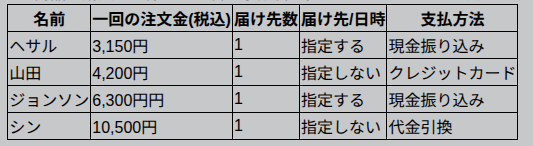

# Câu 11 - Đề thi N2 tháng 7/2014
## 📖 日本語
## <ruby>いずみ<rt>いずみ</rt></ruby>デパート<ruby>通信販売<rt>つうしんはんばい</rt></ruby>ショッピングガイド

### <ruby>ご注文<rt>ごちゅうもん</rt></ruby>

<ruby>ご注文<rt>ごちゅうもん</rt></ruby>は<ruby>以下<rt>いか</rt></ruby>の<ruby>方法<rt>ほうほう</rt></ruby>からお<ruby>選<rt>えら</rt></ruby>びいただけます。

* インターネット [http://www.izumi-shopping.jp](http://www.izumi-shopping.jp)
* <ruby>電話<rt>でんわ</rt></ruby> 0121‐333‐444（<ruby>通話料無料<rt>つうわりょうむりょう</rt></ruby>）
* <ruby>ファックス<rt>ふぁっくす</rt></ruby> 0121‐333‐666（<ruby>通信料無料<rt>つうしんりょうむりょう</rt></ruby>）

---

### <ruby>送料<rt>そうりょう</rt></ruby>

| 1<ruby>回<rt>かい</rt></ruby>の<ruby>ご注文金額<rt>ごちゅうもんきんがく</rt></ruby>                                                       | <ruby>送料<rt>そうりょう</rt></ruby>                                       |
| ---------------------------------------------------------------------------------------------------------------------- | ------------------------------------------------------------------- |
| 5,250<ruby>円<rt>えん</rt></ruby>（<ruby>税込<rt>ぜいこみ</rt></ruby>）<ruby>以上<rt>いじょう</rt></ruby>の<ruby>場合<rt>ばあい</rt></ruby>   | <ruby>全国<rt>ぜんこく</rt></ruby>どこでも<ruby>送料無料<rt>そうりょうむりょう</rt></ruby> |
| 5,250<ruby>円<rt>えん</rt></ruby>（<ruby>税込<rt>ぜいこみ</rt></ruby>）<ruby>未満<rt>みまん</rt></ruby>となった<ruby>場合<rt>ばあい</rt></ruby> | 350<ruby>円<rt>えん</rt></ruby>                                        |

<ruby>複数<rt>ふくすう</rt></ruby>のお<ruby>届<rt>とど</rt></ruby>け<ruby>先<rt>さき</rt></ruby>に<ruby>商品<rt>しょうひん</rt></ruby>を<ruby>発送<rt>はっそう</rt></ruby>することもできます。
（<ruby>一件<rt>いっけん</rt></ruby>あたりのお<ruby>届<rt>とど</rt></ruby>け<ruby>商品<rt>しょうひん</rt></ruby>が 5,250<ruby>円<rt>えん</rt></ruby>（<ruby>税込<rt>ぜいこみ</rt></ruby>）<ruby>未満<rt>みまん</rt></ruby>となった<ruby>場合<rt>ばあい</rt></ruby>、お<ruby>届<rt>とど</rt></ruby>け<ruby>先<rt>さき</rt></ruby>ごとに<ruby>送料<rt>そうりょう</rt></ruby> 350<ruby>円<rt>えん</rt></ruby>が<ruby>必要<rt>ひつよう</rt></ruby>になります。）

---

### <ruby>お届<rt>おとど</rt></ruby>け

<ruby>ご注文受付後<rt>ごちゅうもんうけつけご</rt></ruby>、2～5<ruby>日<rt>にち</rt></ruby>でお<ruby>届<rt>とど</rt></ruby>けします。

<ruby>以下<rt>いか</rt></ruby>をご<ruby>指定<rt>してい</rt></ruby>いただくことができます。（<ruby>手数料無料<rt>てすうりょうむりょう</rt></ruby>）

* お<ruby>届<rt>とど</rt></ruby>け<ruby>先<rt>さき</rt></ruby>・・・ご<ruby>自宅<rt>じたく</rt></ruby>／<ruby>指定<rt>してい</rt></ruby>のお<ruby>届<rt>とど</rt></ruby>け<ruby>先<rt>さき</rt></ruby>
* お<ruby>届<rt>とど</rt></ruby>け<ruby>日<rt>び</rt></ruby>・・・ご<ruby>注文日<rt>ごちゅうもんび</rt></ruby>の6<ruby>日後<rt>にちご</rt></ruby>から30<ruby>日後<rt>にちご</rt></ruby>まで
* お<ruby>届<rt>とど</rt></ruby>け<ruby>時間帯<rt>じかんたい</rt></ruby>・・・<ruby>午前中<rt>ごぜんちゅう</rt></ruby>／12～18<ruby>時<rt>じ</rt></ruby>／18～21<ruby>時<rt>じ</rt></ruby>

---

### <ruby>お支払<rt>おしはら</rt></ruby>い

<ruby>ご注文時<rt>ごちゅうもんじ</rt></ruby>に<ruby>以下<rt>いか</rt></ruby>の<ruby>方法<rt>ほうほう</rt></ruby>の<ruby>中<rt>なか</rt></ruby>からご<ruby>指定<rt>してい</rt></ruby>ください。

* クレジットカード
* <ruby>現金振込<rt>げんきんふりこみ</rt></ruby>（<ruby>手数料無料<rt>てすうりょうむりょう</rt></ruby>）
* <ruby>代金引換<rt>だいきんひきかえ</rt></ruby>＊（<ruby>手数料<rt>てすうりょう</rt></ruby>300<ruby>円<rt>えん</rt></ruby>）
  ※ <ruby>商品<rt>しょうひん</rt></ruby>お<ruby>届<rt>とど</rt></ruby>け<ruby>時<rt>じ</rt></ruby>に<ruby>代金<rt>だいきん</rt></ruby>と<ruby>手数料<rt>てすうりょう</rt></ruby>をお<ruby>支払<rt>しはら</rt></ruby>いください。

---

### <ruby>返品<rt>へんぴん</rt></ruby>・<ruby>交換<rt>こうかん</rt></ruby>

★ <ruby>返品<rt>へんぴん</rt></ruby>・<ruby>交換<rt>こうかん</rt></ruby>をご<ruby>希望<rt>きぼう</rt></ruby>のお<ruby>客様<rt>きゃくさま</rt></ruby>は、まず<ruby>返品<rt>へんぴん</rt></ruby>・<ruby>交換係<rt>こうかんがかり</rt></ruby>にご<ruby>連絡<rt>れんらく</rt></ruby>ください。ご<ruby>連絡<rt>れんらく</rt></ruby>は、<ruby>商品到着後<rt>しょうひんとうちゃくご</rt></ruby>14<ruby>日以内<rt>にちいない</rt></ruby>にお<ruby>願<rt>ねが</rt></ruby>いします。

★ <ruby>商品<rt>しょうひん</rt></ruby>を<ruby>返送<rt>へんそう</rt></ruby>する<ruby>際<rt>さい</rt></ruby>には、<ruby>商品<rt>しょうひん</rt></ruby>と<ruby>一緒<rt>いっしょ</rt></ruby>に<ruby>納品書<rt>のうひんしょ</rt></ruby>を<ruby>返送<rt>へんそう</rt></ruby>してください。<ruby>納品書<rt>のうひんしょ</rt></ruby>の<ruby>返品理由欄<rt>へんぴんりゆうらん</rt></ruby>には、<ruby>返品理由<rt>へんぴんりゆう</rt></ruby>をご<ruby>記入<rt>きにゅう</rt></ruby>ください。なお、<ruby>お客様<rt>おきゃくさま</rt></ruby>のご<ruby>都合<rt>つごう</rt></ruby>による<ruby>返品<rt>へんぴん</rt></ruby>・<ruby>交換<rt>こうかん</rt></ruby>の<ruby>場合<rt>ばあい</rt></ruby>、<ruby>返送料<rt>へんそうりょう</rt></ruby>は<ruby>お客様負担<rt>おきゃくさまふたん</rt></ruby>となります。

★ <ruby>商品代金<rt>しょうひんだいきん</rt></ruby>の<ruby>返金<rt>へんきん</rt></ruby>は<ruby>商品到着確認後<rt>しょうひんとうちゃくかくにんご</rt></ruby>となりますので、2<ruby>週間前後<rt>しゅうかんぜんご</rt></ruby>お<ruby>時間<rt>じかん</rt></ruby>をいただきます。お<ruby>支払<rt>しはら</rt></ruby>いにクレジットカードをご<ruby>利用<rt>りよう</rt></ruby>の<ruby>場合<rt>ばあい</rt></ruby>、<ruby>翌月<rt>よくげつ</rt></ruby>または<ruby>翌々月<rt>よくよくげつ</rt></ruby>になる<ruby>場合<rt>ばあい</rt></ruby>もございますので、ご了承ください。

---

### <ruby>連絡先<rt>れんらくさき</rt></ruby>

0121-333-555（<ruby>通話料無料<rt>つうわりょうむりょう</rt></ruby>）

### <ruby>返送先<rt>へんそうさき</rt></ruby>

000-123 <ruby>やなぎ市<rt>やなぎし</rt></ruby><ruby>北町<rt>きたまち</rt></ruby>5- いずみデパート <ruby>返品<rt>へんぴん</rt></ruby>・<ruby>交換係<rt>こうかんがかり</rt></ruby>

---

## 問い 74

<ruby>商品<rt>しょうひん</rt></ruby>を<ruby>購入<rt>こうにゅう</rt></ruby>する<ruby>際<rt>さい</rt></ruby>に、<ruby>送料<rt>そうりょう</rt></ruby>と<ruby>手数料<rt>てすうりょう</rt></ruby>を<ruby>払<rt>はら</rt></ruby>わなくてもいいのは<ruby>次<rt>つぎ</rt></ruby>の4<ruby>人<rt>にん</rt></ruby>のうち<ruby>誰<rt>だれ</rt></ruby>か。

1. ヘサルさん
2. <ruby>山田<rt>やまだ</rt></ruby>さん
3. ジョンソンさん
4. シンさん

---

## 問い 75

<ruby>返品<rt>へんぴん</rt></ruby>・<ruby>交換<rt>こうかん</rt></ruby>をしたい<ruby>人<rt>ひと</rt></ruby>が<ruby>注意<rt>ちゅうい</rt></ruby>しなければならないことはどれか。

1. <ruby>連絡<rt>れんらく</rt></ruby>は、<ruby>商品<rt>しょうひん</rt></ruby>を<ruby>返送<rt>へんそう</rt></ruby>する<ruby>前<rt>まえ</rt></ruby>か<ruby>返送直後<rt>へんそうちょくご</rt></ruby>にする。
2. <ruby>返送<rt>へんそう</rt></ruby>は、<ruby>商品到着後<rt>しょうひんとうちゃくご</rt></ruby>14<ruby>日以内<rt>にちいない</rt></ruby>に<ruby>行<rt>おこな</rt></ruby>う。
3. <ruby>商品<rt>しょうひん</rt></ruby>は、<ruby>返品理由<rt>へんぴんりゆう</rt></ruby>を<ruby>書<rt>か</rt></ruby>いた<ruby>納品書<rt>のうひんしょ</rt></ruby>と<ruby>一緒<rt>いっしょ</rt></ruby>に<ruby>返送<rt>へんそう</rt></ruby>する。
4. <ruby>返送料<rt>へんそうりょう</rt></ruby>は、<ruby>返品<rt>へんぴん</rt></ruby>・<ruby>交換理由<rt>こうかんりゆう</rt></ruby>にかかわらず<ruby>自身<rt>じしん</rt></ruby>が<ruby>負担<rt>ふたん</rt></ruby>する。

## 📘 Tiếng Việt (Bản dịch)

  <a href="/exam/n2/2014/">← Quay lại danh sách</a>

