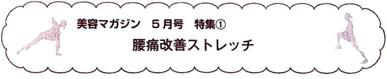

## 📖 日本語（Bản gốc tiếng Nhật）

ストレッチは1日1回でもOK。初めはできる回数だけ行い、徐々に増やしていきましょう。

**ひざ抱え**
〜背中から腰を伸ばすストレッチ〜

まず、あお向けに寝て、両足を揃えてひざを立てます。両手で右ひざを抱え、胸のほうに引き寄せ、10秒間そのままにしてください。この時、背中と床にすき間ができないようにしましょう。反対側も同様に行ってください。

次に、両手で両ひざを胸に抱え、体にぐっと近づけ、10秒間そのままにしてください。ポイントは、腰からお尻にかけての筋肉が伸びているのを意識することです。

---

**あお向け：** 顔や体の前面が上を向いていること

---

**問題１ ひざを抱える順番はどうなるか。**

1. 両ひざ ⇒ 右ひざ ⇒ 両ひざ
2. 右ひざ ⇒ 両ひざ ⇒ 左ひざ
3. 右ひざ ⇒ 右ひざ ⇒ 両ひざ
4. 両ひざ ⇒ 右ひざ ⇒ 左ひざ

## 📘 Tiếng Việt (Bản dịch)

Kéo giãn (stretch) dù chỉ 1 lần/ngày cũng được. Ban đầu, hãy thực hiện số lần có thể, sau đó tăng dần lên.

**Ôm gối**
~Bài tập kéo giãn làm thẳng lưng và hông~

Đầu tiên, nằm ngửa, chụm hai chân lại và gập gối. Dùng cả hai tay ôm lấy đầu gối phải, kéo về phía ngực và giữ nguyên trong 10 giây. Lúc này, hãy đảm bảo không có khe hở giữa lưng và sàn nhà. Thực hiện tương tự với bên còn lại.

Tiếp theo, dùng cả hai tay ôm cả hai đầu gối vào ngực, kéo sát vào cơ thể và giữ nguyên trong 10 giây. Điểm mấu chốt là phải cảm nhận được các cơ từ thắt lưng đến mông đang được kéo giãn.

---

**Nằm ngửa (あお向け):** Mặt hoặc phần trước của cơ thể hướng lên trên.

---

**Câu hỏi 1: Thứ tự ôm gối sẽ như thế nào?**

1. Cả hai gối ⇒ Gối phải ⇒ Cả hai gối
2. Gối phải ⇒ Cả hai gối ⇒ Gối trái
3. Gối phải ⇒ Gối phải ⇒ Cả hai gối
4. Cả hai gối ⇒ Gối phải ⇒ Gối trái
