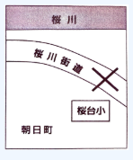

## 📖 日本語（Bản gốc tiếng Nhật）

### 青葉市ホームページ

## 避難準備情報

こちらは、<ruby>青葉市<rt>あおばし</rt></ruby><ruby>災害対策本部<rt>さいがいたいさくほんぶ</rt></ruby>です。

<ruby>昨晩<rt>さくばん</rt></ruby>からの<ruby>集中豪雨<rt>しゅうちゅうごうう</rt></ruby>により、<ruby>桜川<rt>さくらがわ</rt></ruby>の<ruby>水位<rt>すいい</rt></ruby>が<ruby>上昇<rt>じょうしょう</rt></ruby>、<ruby>浸水<rt>しんすい</rt></ruby>の<ruby>おそれ<rt>おそれ</rt></ruby>があります。

このため、<ruby>桜台地区<rt>さくらだいちく</rt></ruby>に<ruby>対<rt>たい</rt></ruby>して、１１<ruby>時<rt>じ</rt></ruby>２０<ruby>分<rt>ふん</rt></ruby>に<ruby>避難準備情報<rt>ひなんじゅんびじょうほう</rt></ruby>を<ruby>出<rt>だ</rt></ruby>しました。
いつでも<ruby>避難<rt>ひなん</rt></ruby>ができるように、<ruby>避難準備<rt>ひなんじゅんび</rt></ruby>を<ruby>始<rt>はじ</rt></ruby>めてください。

また、<ruby>近隣<rt>きんりん</rt></ruby>の<ruby>方<rt>かた</rt></ruby>にもできるだけ<ruby>声<rt>こえ</rt></ruby>をかけてください。

<ruby>年寄<rt>としよ</rt></ruby>りの<ruby>方<rt>かた</rt></ruby>など、<ruby>避難<rt>ひなん</rt></ruby>に<ruby>時間<rt>じかん</rt></ruby>がかかる<ruby>方<rt>かた</rt></ruby>は、<ruby>直<rt>ただ</rt></ruby>ちに<ruby>桜台小学校<rt>さくらだいしょうがっこう</rt></ruby>に<ruby>避難<rt>ひなん</rt></ruby>してください。

なお、<ruby>桜川街道<rt>さくらがわかいどう</rt></ruby>は<ruby>現在<rt>げんざい</rt></ruby><ruby>通行止<rt>つうこうど</rt></ruby>めです。<ruby>桜台小学校<rt>さくらだいしょうがっこう</rt></ruby>へは、<ruby>車<rt>くるま</rt></ruby>は<ruby>使<rt>つか</rt></ruby>わず<ruby>徒歩<rt>とほ</rt></ruby>で、<ruby>朝日町<rt>あさひちょう</rt></ruby><ruby>方面<rt>ほうめん</rt></ruby>に<ruby>迂回<rt>うかい</rt></ruby>して<ruby>移動<rt>いどう</rt></ruby>してください。

<ruby>青葉市<rt>あおばし</rt></ruby>　<ruby>災害対策本部<rt>さいがいたいさくほんぶ</rt></ruby>
１２３４－５６７８
saigai@aoba.or.jp

※ <ruby>迂回<rt>うかい</rt></ruby>：あるところを<ruby>避<rt>さ</rt></ruby>けて、<ruby>遠回<rt>とおまわ</rt></ruby>りしていくこと

---

※ 迂回：あるところを避けて、遠回りしていくこと

---

### 問題１　高齢者は、今からどうしなければならないか。

1. 桜川街道を通って、桜台小学校に避難する。
2. 朝日町方面を通って、桜台小学校に避難する。
3. 近所の人と一緒に、避難準備をする。
4. 避難準備をしてから、市の災害対策本部に問い合わせる。

## 📘 Tiếng Việt (Bản dịch)

Đây là **Trung tâm đối phó thiên tai thành phố Aoba**.

Do mưa lớn liên tục từ đêm qua, mực nước sông Sakura đang dâng cao, có nguy cơ ngập lụt.
Vì lý do này, chúng tôi đã ban hành **cảnh báo chuẩn bị sơ tán** lúc 11 giờ 20 phút cho khu vực Sakuradai.

Hãy bắt đầu chuẩn bị để có thể sơ tán bất cứ lúc nào.
Đồng thời, hãy kêu gọi giúp đỡ những người hàng xóm xung quanh càng nhiều càng tốt.
Đối với những **người cao tuổi** hoặc những người cần nhiều thời gian để sơ tán, hãy **lập tức sơ tán đến Trường tiểu học Sakuradai**.
Xin lưu ý, đường Sakuragawa hiện đang bị cấm. Để đến Trường tiểu học Sakuradai, không sử dụng ô tô mà hãy đi bộ, **đi vòng qua hướng Asahimachi**.

Trung tâm đối phó thiên tai thành phố Aoba
1234-5678
saigai@aoba.or.jp

\* **U-kai (迂回)**: Đi đường vòng, tránh một địa điểm nào đó.

---

## Giải thích đáp án 問題１ (Vấn đề 1)

**Câu 2: 朝日町方面を通って、桜台小学校に避難する。** (Đi qua hướng Asahimachi để sơ tán đến Trường tiểu học Sakuradai.)

**Lý do:** Thông báo nêu rõ: "お年寄りの方など、避難に時間がかかる方は、直ちに桜台小学校に避難してください。" (Đối với những người cao tuổi hoặc những người cần nhiều thời gian để sơ tán, hãy lập tức sơ tán đến Trường tiểu học Sakuradai.) và "桜川街道は現在通行止めです。桜台小学校へは、車は使わず徒歩で、朝日町方面に迂回して移動してください。" (Đường Sakuragawa hiện đang bị cấm. Để đến Trường tiểu học Sakuradai, không sử dụng ô tô mà hãy đi bộ, đi vòng qua hướng Asahimachi.)

Ghép hai thông tin này lại, người cao tuổi cần **lập tức sơ tán** đến Trường tiểu học Sakuradai và phải đi **bộ, vòng qua hướng Asahimachi**.

Các đáp án khác không phù hợp:
* **Câu 1: 桜川街道を通って、桜台小学校に避難する。** (Đi qua đường Sakuragawa để sơ tán đến Trường tiểu học Sakuradai.) - Sai, vì thông báo nói rõ đường Sakuragawa đã bị cấm.
* **Câu 3: 近所の人と一緒に、避難準備をする。** (Cùng với hàng xóm chuẩn bị sơ tán.) - Việc chuẩn bị là cho tất cả mọi người, nhưng người cao tuổi được yêu cầu **lập tức sơ tán**, không phải chỉ chuẩn bị.
* **Câu 4: 避難準備をしてから、市の災害対策本部に問い合わせる。** (Sau khi chuẩn bị sơ tán, liên hệ với trung tâm đối phó thiên tai của thành phố.) - Người cao tuổi được yêu cầu sơ tán ngay lập tức, không phải trì hoãn để chuẩn bị hoặc liên hệ.